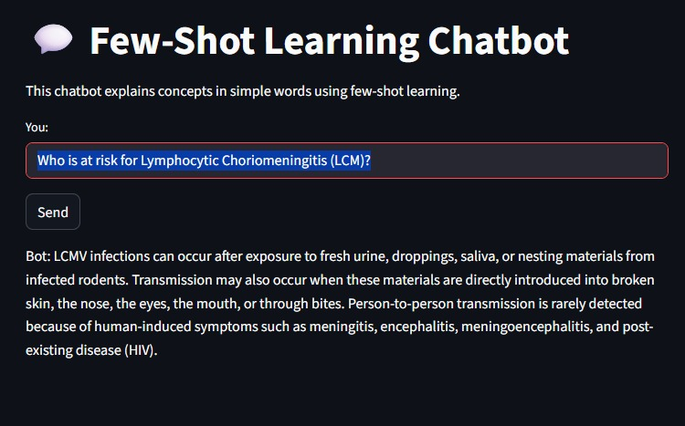

# 🏥 AI Medical Chatbot (Multi-Model, Quantized)





This project implements a **medical chatbot** using multiple **Large Language Models (LLMs)** fine-tuned on medical Q&A datasets.  
I used different LLMs like **BioMistral-7B**, **LLaMA 3.2 Instruct (4-bit, via Unsloth)**, and **DialoGPT-medium**, and is deployed as an interactive **Streamlit app** running in Google Colab via **ngrok**.  

⚡️ The chatbot also supports **4-bit quantization**, reducing memory usage and making large models like LLaMA efficient to run on limited hardware (such as Google Colab GPUs).  

⚠️ **Disclaimer**: This chatbot is for **educational and research purposes only**.  
It must not be used as a substitute for professional medical advice, diagnosis, or treatment.  

---

## 🚀 Features
- **Multiple model support**:
  - [BioMistral-7B](https://huggingface.co/BioMistral/BioMistral-7B) – Biomedical language model.
  - [LLaMA 3.2-3B Instruct (4-bit, Unsloth)](https://huggingface.co/unsloth/llama-3.2-3b-instruct-bnb-4bit) – Efficient instruction-tuned model with quantization.
  - [DialoGPT-medium](https://huggingface.co/microsoft/DialoGPT-medium) – Conversational model for dialogue.  
- **Fine-tuned** on Kaggle medical Q&A datasets:
  - [Comprehensive Medical Q&A Dataset](https://www.kaggle.com/datasets/thedevastator/comprehensive-medical-q-a-dataset)  
  - [AI Medical Chatbot Dataset](https://www.kaggle.com/datasets/thedevastator/comprehensive-medical-q-a-dataset)  
- **4-bit quantization** for memory-efficient inference.  
- **Streamlit + ngrok deployment** for interactive chatbot access in Colab.  


## 📂 Project Structure

    notebooks/
    ├── medical_chatbot_mistral.ipynb       # Fine-tuned BioMistral
    ├── medical_chatbot_llama.ipynb         # LLaMA (4-bit quantization)
    ├── medical-chatbot_DialoGPT.ipynb      # DialoGPT chatbot
    results/                                # Model checkpoints & configs
    requirements.txt                        # Python dependencies
    README.md                               # Documentation


## ⚙️ Installation

1. Clone the repository:

  * git clone 
      ```https://github.com/ahmdeltoky03/ai-medical-chatbot.git```
  * ```cd ai-medical-chatbot```

1. Install dependencies:
  ```pip install -r requirements.txt```


##  Usage

1. Fine-Tuning

        Fine-tune BioMistral, LLaMA, and DialoGPT using Kaggle datasets:

        !kaggle datasets download -d thedevastator/comprehensive-medical-q-a-dataset (for BioMistral, Llama)
        !kaggle datasets download -d thedevastator/ai-medical-chatbot (for DialoGPT)

2. 4-Bit Quantization (LLaMA via Unsloth)

        The LLaMA model is loaded in 4-bit quantized format to reduce memory usage:

        from unsloth import FastLanguageModel
        model, tokenizer = FastLanguageModel.from_pretrained(
            model_name="unsloth/llama-3.2-3b-instruct-bnb-4bit",
            load_in_4bit=True,
        )

    This allows running large LLMs on Google Colab T4 / A100 GPUs with limited memory.

3. Run Streamlit App in Colab
  
        !pip install streamlit ngrok
        !streamlit run app.py & npx localtunnel --port 8501

      `Open the generated ngrok URL ( opened streamlit app ) to use the chatbot.`

## 📌 Limitations

- May hallucinate or generate inaccurate responses.
- Quantization trades slight accuracy for higher efficiency.
- Not a replacement for certified medical professionals.


--- 
